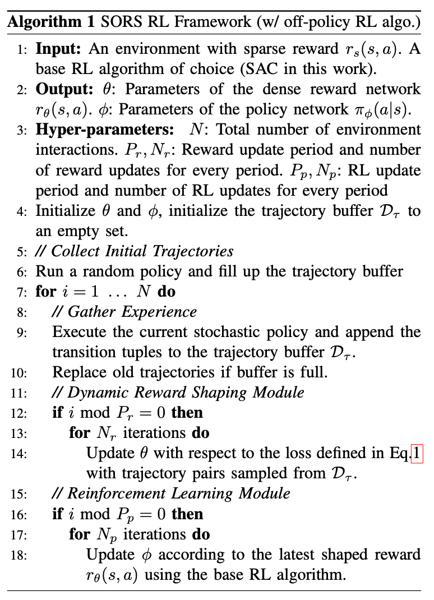
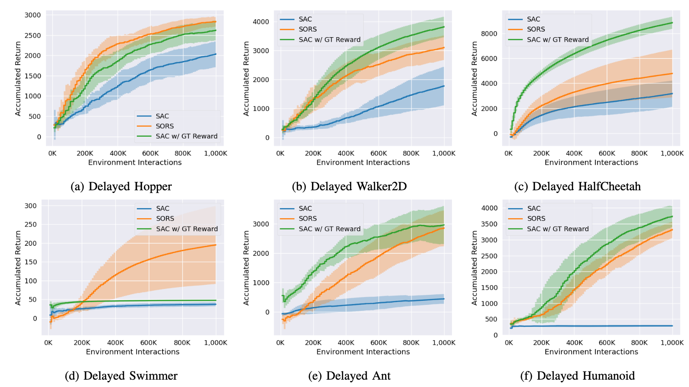

# Self-Supervised Online Reward Shaping in Sparse-Reward Environments (SORS)

Farzan Memarian*, Wonjoon Goo*, Rudolf Lioutikov, Scott Niekum, and Ufuk Tocpu (* equal contribution)

<p align=center>
  
  
</p>

<p align="center">
  <a href="https://arxiv.org/abs/2103.04529">View on ArXiv</a>
</p>

This repository contains a code used to conduct experiments reported in the paper.

## How to Use

### Prerequisite

```
mujoco200
conda
```

- Remember to add the mujoco directory to `LD_LIBRARY_PATH` environment variable.
- All the other dependencies will be handled in the following installation script via conda.

### Install

```
git clone https://github.com/hiwonjoon/IROS2021_SORS.git
cd IROS2021_SORS
conda env create --file env.yaml --name sors
conda activate sors
# in the case of error during creation, use conda update commands:
# conda env update --file env.yaml
```

### Run

```
python -m SORS.scripts.sors --seed {seed} --log_dir ./log/directory/you/want --config_file ./SORS/experiments/sors.gin ./SORS/experiments/envs/delayed_{env_name}.gin # SORS
python -m SORS.scripts.offpolicy_rl --seed {seed} --log_dir ./log/directory/you/want --config_file ./SORS/experiments/sac.gin ./SORS/experiments/envs/delayed_{env_name}.gin # sac baseline
python -m SORS.scripts.offpolicy_rl --seed {seed} --log_dir ./log/directory/you/want --config_file ./SORS/experiments/sac.gin ./SORS/experiments/envs/{env_name}.gin # sac baseline with gt reward
```

You can check the results on `tensorboard`.
```
tensorboard --logdir ./log
```

## Citation

If you find this repository is useful in your research, please cite the paper:

```
@inproceedings{Memarian2021SORS,
  author = {Farzan Memarian and Wonjoon Goo and Rudolf Lioutikov and Scott Niekum and and Ufuk Tocpu},
  booktitle = {IEEE/RSJ International Conference on Intelligent Robots and Systems (IROS)},
  title = {Self-Supervised Online Reward Shaping in Sparse-Reward Environments},
  year = {2021}
}
```

## Trouble-shootings

- Mujoco-py related problems: reinstall `mujoco-py`
```
pip uninstall mujoco-py
pip install mujoco-py==2.0.2.13 --no-cache-dir --no-binary :all: --no-build-isolation
```
